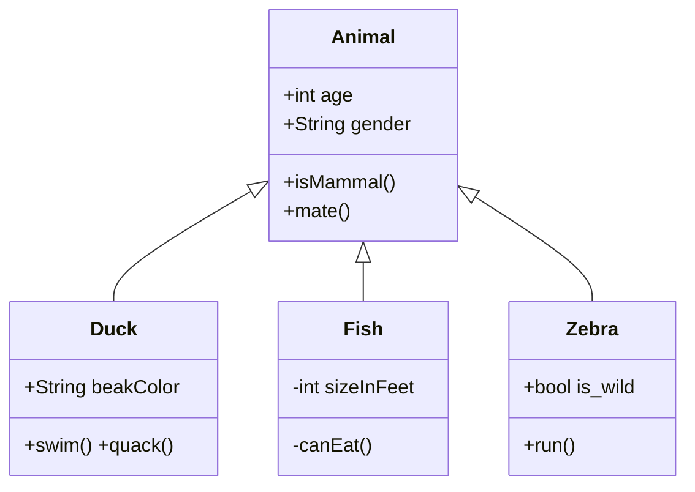

## 옵저버 패턴이란?
옵저버 패턴(Observer Pattern)은 한 객체의 상태가 바뀌면 그 객체에 의존하는 다른 객체에게 연락이 가고 자동으로 내용이 갱신되는 방식으로 일대다(one-to-many) 의존성을 정의합니다.

## 느슨한 결합
느슨한 결합(Loose Coupling)은 객체들이 상호작용할 수는 있지만, 서로를 잘 모르는 관계를 의미한다. 유연성이 좋아진다.

- 주제는 옵저버가 특정 인터페이스(Observer 인터페이스)를 구현한다는 사실만 안다.
	옵저버의 구상 클래스가 무엇인지, 옵저버가 무엇을 하는지 알 필요도 없다.

- 옵저버는 언제든지 새로 추가할 수 있다.
	주제는 Observer 인터페이스를 구현하는 객체의 목록에만 의존하므로 언제든지 새로운 옵저버를 추가할 수 있다.

- 새로운 형식의 옵저버를 추가할 때도 주제를 변경할 필요가 전혀 없다.
	옵저버가 되어야 하는 새로운 구상 클래스가 생겼다고 가정해 볼때, 이때도 새로운 클래스 형식을 받아들일 수 있도록 주제를 바꿔야 할 필요는 없다. 새로운 클래스에서 Observer 인터페이스를 구현하고 옵저버로 등록하기만 하면 된다.

- 주제와 옵저버는 서로 독립적으로 재사용할 수 있다.
	주제나 옵저버를 다른 용도로 활용할 일이 있다고 해도 손쉽게 재사용할 수 있다.

- 주제나 옵저버가 달라져도 서로에게 영향을 미치지 않는다.
	서로 느슨하게 결합되어 있으므로 주제나 옵저버 인터페이스를 구현하다는 조건만 만족한다면 어떻게 고쳐도 문제가 생기지 않는다.

> **상호작용하는 객체 사이에는 가능하면 느슨한 결합을 사용해야 한다**
>
> 느슨하게 결합하는 디자인을 사용하면 변경 사항이 생겨도 무난히 처리할 수 있는 유연한 객체지향 시스템을 구축할 수 있다. 객체 사이의 상호의존성을 최소화할 수 있기 때문이다. 

